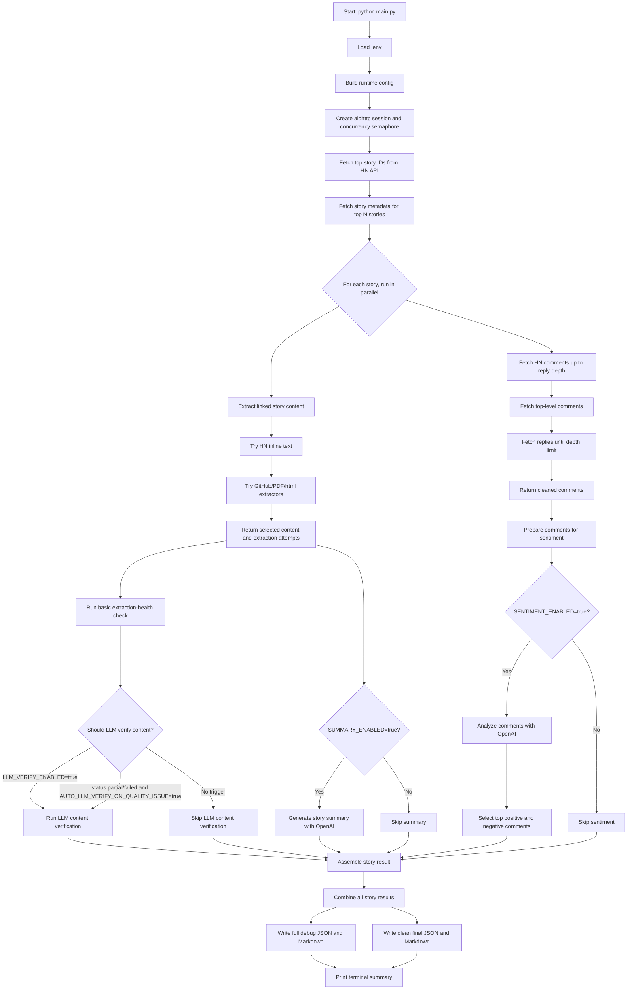

# Hacker News Pipeline Flow

This diagram shows how `main.py` runs the project from configuration to final
outputs.



## Simple Explanation

1. `main.py` loads settings from `.env`.
2. It fetches the current top Hacker News stories.
3. For each story, it does two main jobs at the same time:
   - extracts the linked article/post content
   - fetches comments from Hacker News
4. It runs a basic extraction-health check on the extracted content.
5. LLM content verification runs only when forced or when extraction looks
   problematic.
6. The summary step creates a story summary with OpenAI.
7. The sentiment step ranks the top positive and negative comments with OpenAI.
8. The project writes two output types:
   - full debug output with all details
   - clean final output for submission

## Output Files

```text
final_report.json
final_report.md
outputs/raw_debug_output.json
outputs/raw_debug_output.md
```
